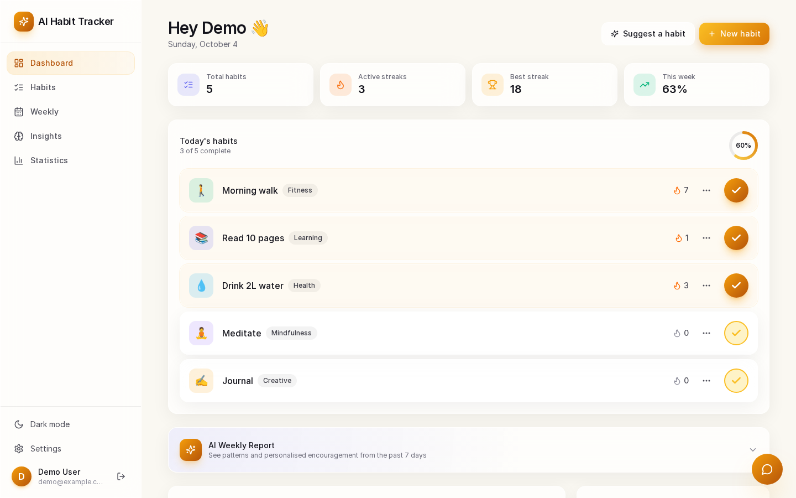
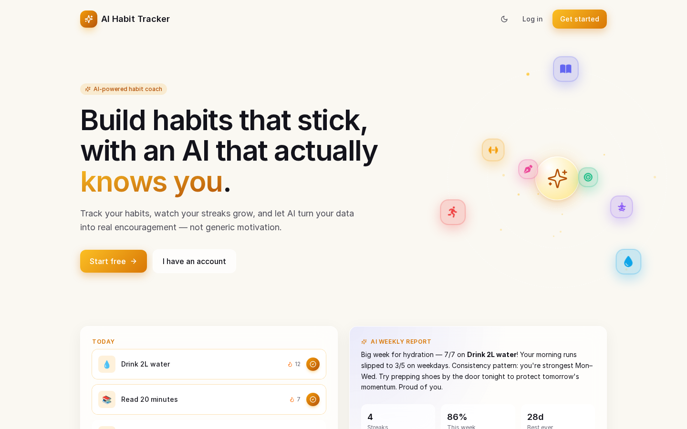
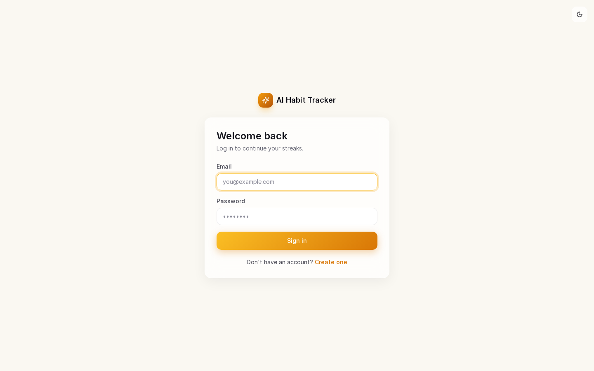
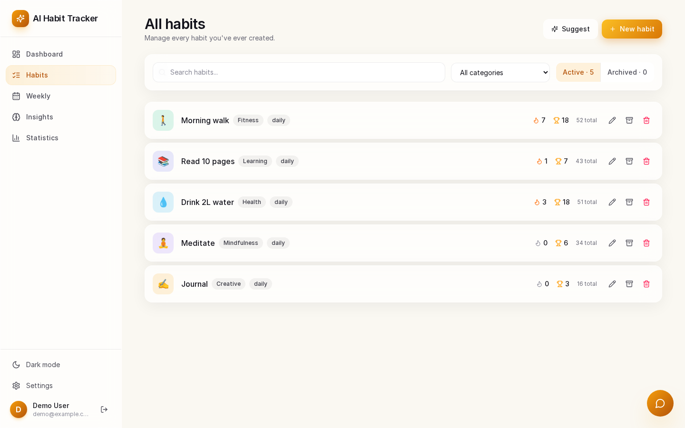
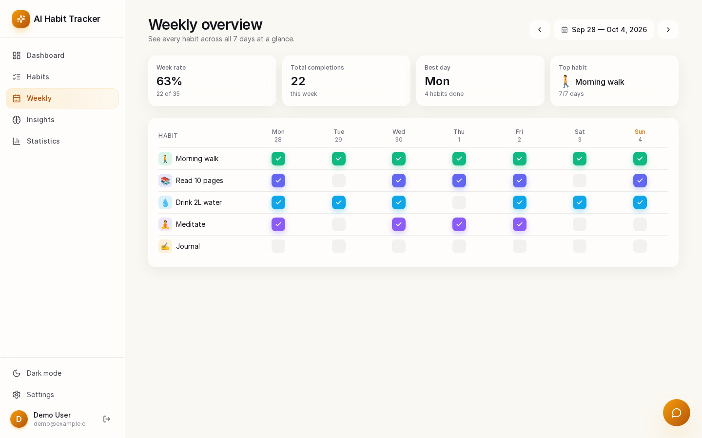
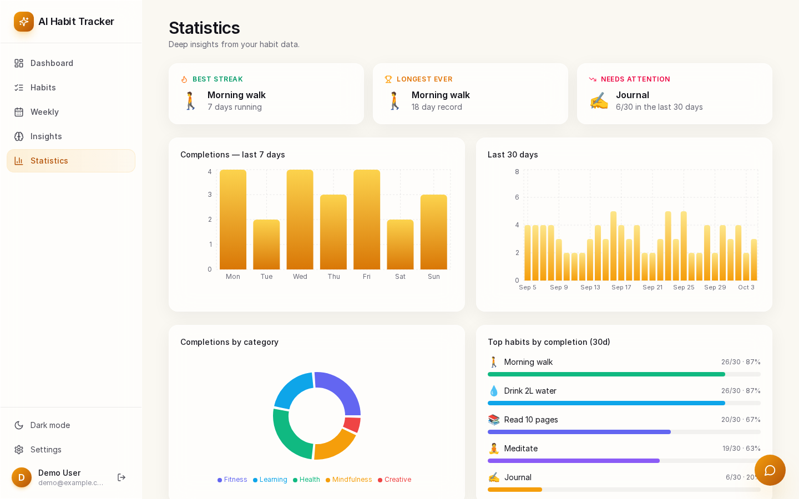
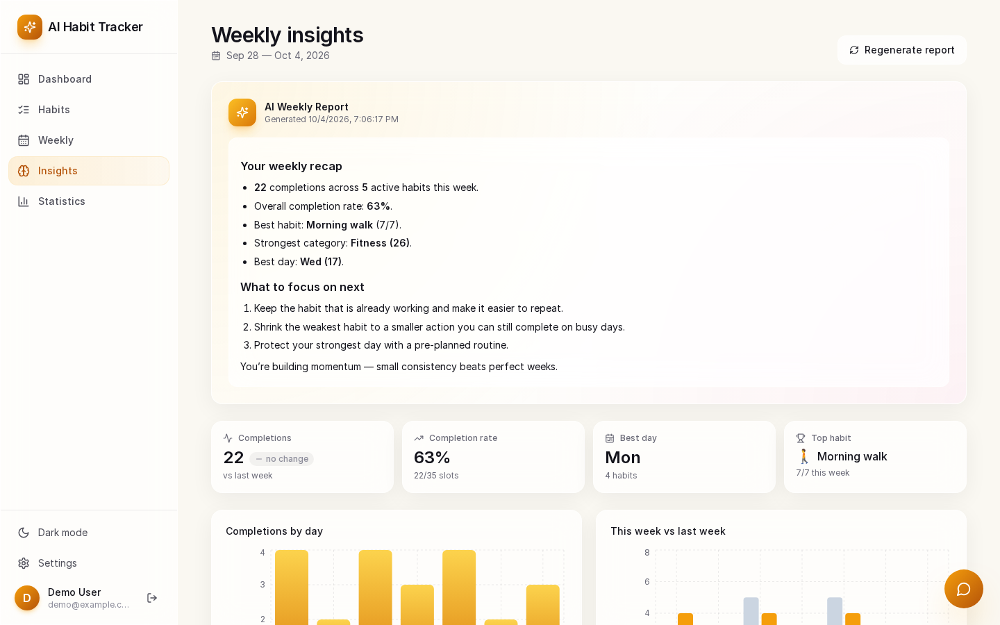
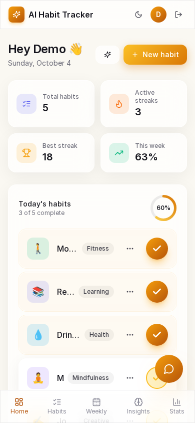

<div align="center">

# ✨ AI Habit Tracker

**Build habits that stick, with an AI coach grounded in your own habit data.**

A full-stack MERN habit tracker: daily check-offs, streaks, charts and a 90-day heatmap, plus AI-generated weekly reports, streak-recovery plans, habit suggestions and a chat assistant that answers questions about your habits.

[](https://github.com/ShibilAhamed701212/ai-habit-tracker/actions/workflows/ci.yml)
[](https://react.dev)
[](https://nodejs.org)
[](https://mongoosejs.com)
[](https://ai.google.dev)
[](./LICENSE)

</div>



---

## Contents

- [Features](#-features)
- [Screenshots](#-screenshots)
- [Tech stack](#️-tech-stack)
- [Architecture](#-architecture)
- [Project structure](#-project-structure)
- [Quick start](#-quick-start)
- [Environment variables](#-environment-variables)
- [API reference](#-api-reference)
- [Testing](#-testing)
- [Deployment](#-deployment)
- [Troubleshooting](#-troubleshooting)
- [Known limitations](#-known-limitations)
- [Changelog](#-changelog)

## 🚀 Features

| Feature | Description |
|---------|-------------|
| ✅ **Daily habit tracking** | One-click check-offs with a progress ring, per-habit streaks and confetti when you finish the day |
| 📊 **Statistics** | 7-day and 30-day bar charts, completions by category, top/needs-attention habits, 90-day heatmap |
| 📅 **Weekly grid** | Habit × day matrix with week-by-week navigation |
| 🤖 **AI weekly report** | Markdown report on what went well, what slipped and next steps |
| 💬 **AI chat** | Ask questions such as *"Which day am I most consistent?"*; answers use a summary of your habit data |
| 💡 **AI habit suggestions** | Answer three questions (goals, productive time, struggles) and get three habit ideas you can add in one click |
| ❤️ **Streak recovery** | When a streak of 7+ days breaks, the dashboard offers an AI 3-day comeback plan |
| 🌅 **Morning motivation** | Optional AI message on the dashboard, toggled in Settings |
| 🗂️ **Archive** | Archive habits without losing their history |
| 🌙 **Dark / light mode** | Follows the system theme on first visit, with a manual toggle |
| 📱 **Responsive** | Desktop sidebar and mobile bottom navigation |

**AI without an API key.** Every AI endpoint has a deterministic, data-driven fallback. If no provider key is configured, or the provider fails or times out, the API returns the fallback text instead of an error, so the app is fully usable offline from AI.

## 📸 Screenshots

These were captured from this repository running locally with a seeded demo account and **no AI key configured**, so the AI panels show the built-in fallback text rather than model output.

| Landing | Login |
|---|---|
|  |  |
| **Habits** | **Weekly grid** |
|  |  |
| **Statistics** | **Insights (weekly report)** |
|  |  |

<p align="center"></p>

## 🛠️ Tech stack

**Frontend** (`front-end/`)
- React 19 + Vite 8
- Tailwind CSS 4 (`@tailwindcss/vite`)
- React Router 6, Axios
- Recharts (charts), react-markdown (AI output), Lucide icons, canvas-confetti
- ESLint 10 (flat config)

**Backend** (`back-end/`)
- Node.js (ES modules) + Express 4
- MongoDB with Mongoose 8
- JWT auth (jsonwebtoken + bcryptjs)
- Helmet, CORS allow-list, express-rate-limit
- Google Gemini (primary AI provider) and any OpenAI-compatible chat endpoint such as OpenRouter (fallback provider), called with the built-in `fetch`
- Tests: `node:test` + supertest + mongodb-memory-server

## 🧭 Architecture

```
Browser (React SPA, :5173)
   │  Axios, Authorization: Bearer <JWT from localStorage>
   ▼
Express API (:8000)  /api/auth  /api/habits  /api/logs  /api/ai
   │  helmet → CORS → rate limit (auth, ai) → JSON body → protect (JWT) → controller
   ├──► MongoDB: users, habits, habitlogs
   └──► AI: Gemini → OpenAI-compatible provider → deterministic fallback
```

- **Data model.** `User` (bcrypt-hashed password, `morningMotivation` flag), `Habit` (name, category from a fixed list, frequency, colour, icon, order, `isArchived`) and `HabitLog` (one document per habit per day, `completedDate` stored as a `YYYY-MM-DD` string with a unique `{userId, habitId, completedDate}` index). Every query is scoped to the authenticated user.
- **Dates.** Completion dates are calendar-day strings chosen by the client in the user's local timezone. Endpoints that need "today" accept the client's date (`/logs/today?date=`, `/logs/heatmap?end=`) and fall back to the server's local date.
- **AI pipeline.** The controller builds a snapshot of the user's habits and logs (7/30-day completions, streaks, top habit, top category, best weekday), puts a JSON summary into a prompt, and tries Gemini, then the OpenAI-compatible provider (30 s timeout each). Chat history from the client is limited to the last 20 user/assistant turns. Suggested habits are normalised to valid categories and frequencies before they reach the client.

## 📁 Project structure

```
ai-habit-tracker/
├── back-end/
│   ├── app.js               # Express app (middleware + routes), exported for tests
│   ├── server.js            # Entry point: validates env, connects MongoDB, listens
│   ├── config/              # env loading, MongoDB connection
│   ├── controllers/         # auth, habits, logs, AI
│   ├── middleware/          # JWT auth, validation, error handler, helmet
│   ├── models/              # User, Habit, HabitLog
│   ├── routes/              # Express routers
│   ├── utils/               # AppError, asyncHandler, date helpers / streaks
│   ├── tests/               # node:test suites (API + unit)
│   └── scripts/             # PowerShell smoke test against a running server
├── front-end/
│   └── src/
│       ├── api/             # Axios instance (token + 401 handling)
│       ├── components/      # Charts, cards, modals, AI widgets, layout
│       ├── context/         # AuthContext, ThemeContext
│       ├── pages/           # Landing, Login, Register, Dashboard, Habits, Weekly, Insights, Stats
│       └── utils/           # Date helpers, constants, confetti
├── bruno/                   # Bruno API collection + Node smoke-test script
├── docs/screenshots/        # Screenshots used in this README
└── .github/workflows/ci.yml # Backend tests + frontend lint/build
```

## ⚡ Quick start

### Prerequisites

- **Node.js 20.19+** (or 22.12+), required by Vite 8 and the test tooling
- **MongoDB**: a local `mongod` or a [MongoDB Atlas](https://www.mongodb.com/atlas) cluster
- *Optional:* a **Gemini API key** from [Google AI Studio](https://aistudio.google.com/apikey) and/or an OpenRouter key

### 1. Clone

```bash
git clone https://github.com/ShibilAhamed701212/ai-habit-tracker.git
cd ai-habit-tracker
```

### 2. Backend

```bash
cd back-end
cp .env.example .env      # then set MONGO_URI and JWT_SECRET at minimum
npm install
npm run dev               # nodemon; use `npm start` for plain node
```

The API listens on `http://localhost:8000` (check `GET /api/health`). The server exits on start-up if `MONGO_URI` or `JWT_SECRET` is missing or MongoDB is unreachable within 10 seconds.

### 3. Frontend

```bash
cd front-end
cp .env.example .env      # VITE_API_URL=http://localhost:8000/api
npm install
npm run dev
```

Open `http://localhost:5173`, create an account, add a habit and check it off.

| Script | Where | What it does |
|---|---|---|
| `npm run dev` | back-end | Start API with nodemon |
| `npm start` | back-end | Start API with node |
| `npm test` | back-end | Run the automated test suite |
| `npm run test:api` | back-end | PowerShell smoke test against a running API (Windows) |
| `npm run dev` | front-end | Vite dev server |
| `npm run lint` | front-end | ESLint |
| `npm run build` / `npm run preview` | front-end | Production build / preview it |

## 🔑 Environment variables

### Backend (`back-end/.env`)

Values already set in the process environment take precedence over `.env`.

| Variable | Required | Default | Description |
|----------|----------|---------|-------------|
| `MONGO_URI` | ✅ | | MongoDB connection string |
| `JWT_SECRET` | ✅ | | Secret for signing JWTs (use a long random string) |
| `PORT` | | `8000` | API port |
| `NODE_ENV` | | `development` | `production` hides stack traces and tightens rate limits |
| `JWT_EXPIRES_IN` | | `30d` | Token lifetime |
| `CLIENT_URL` | | | Comma-separated extra CORS origins. `localhost`/`127.0.0.1` on any port are always allowed |
| `GEMINI_API_KEY` | | | Enables Gemini (sent in the `x-goog-api-key` header) |
| `GEMINI_MODEL` | | `models/gemini-2.5-flash` | Gemini model path |
| `OPENROUTER_API_KEY` | | | Enables the OpenAI-compatible fallback provider (`NVIDIA_API_KEY` is also accepted) |
| `OPENROUTER_BASE_URL` | | `https://openrouter.ai/api/v1` | Base URL of the OpenAI-compatible API (`NVIDIA_BASE_URL` also accepted) |
| `OPENROUTER_MODEL` | | `minimaxai/minimax-m2.7` | Model id for that provider (`NVIDIA_MODEL` also accepted) |

### Frontend (`front-end/.env`)

| Variable | Required | Default | Description |
|----------|----------|---------|-------------|
| `VITE_API_URL` | | `http://localhost:8000/api` | Backend API base URL (baked in at build time) |

## 📡 API reference

All routes are under `/api`. 🔒 routes need `Authorization: Bearer <token>`. Errors are returned as `{ "message": "..." }` with a 4xx/5xx status. Dates are `YYYY-MM-DD`.

**Rate limits** (per IP, 15-minute window): `/api/auth/*` 20 requests in production (100 otherwise); `/api/ai/*` 30 in production (200 otherwise).

### Health

| Method | Endpoint | Description |
|--------|----------|-------------|
| GET | `/api/health` | `{ status: "ok", time }` |

### Auth

| Method | Endpoint | Body | Description |
|--------|----------|------|-------------|
| POST | `/api/auth/register` | `{ name, email, password }` (password 6–128 chars) | Returns `201 { user, token }` |
| POST | `/api/auth/login` | `{ email, password }` | Returns `{ user, token }` |
| GET 🔒 | `/api/auth/me` | | Current user |
| PUT 🔒 | `/api/auth/profile` | `{ name?, morningMotivation? }` | Update profile |

### Habits 🔒

| Method | Endpoint | Description |
|--------|----------|-------------|
| GET | `/api/habits?includeArchived=true` | List habits (archived ones only with the flag) |
| POST | `/api/habits` | Create: `{ name, description?, category?, frequency?, targetDays?, color?, icon? }` |
| PUT | `/api/habits/:id` | Update any of the fields above, or `order` |
| DELETE | `/api/habits/:id` | Delete the habit and its logs |
| PUT | `/api/habits/:id/archive` | Toggle archived |
| PUT | `/api/habits/reorder` | `{ order: [habitId, ...] }` sets `order` by array position |

Categories: `Health, Fitness, Learning, Mindfulness, Productivity, Social, Finance, Creative, Other`. Frequency: `daily` or `weekly`.

### Logs 🔒

| Method | Endpoint | Description |
|--------|----------|-------------|
| POST | `/api/logs` | Mark complete: `{ habitId, date? }` (idempotent) |
| DELETE | `/api/logs` | Unmark: `{ habitId, date? }` |
| GET | `/api/logs/today?date=` | Completions for `date` (default: server's today) |
| GET | `/api/logs/range?start=&end=` | Completions between two dates (inclusive) |
| GET | `/api/logs/heatmap?end=` | 90 `{ date, count }` entries ending at `end` (default: server's today) |
| GET | `/api/logs/stats` | Per active habit: 30-day completions, current and longest streak (all-time) |
| GET | `/api/logs/stats/:habitId` | One habit: totals, streaks, completion rate since creation, monthly counts |

### AI 🔒

| Method | Endpoint | Body | Response |
|--------|----------|------|----------|
| GET | `/api/ai/morning` | | `{ content }` (markdown) |
| POST | `/api/ai/weekly-report` | | `{ content }` |
| POST | `/api/ai/suggest-habits` | `{ goals, productiveTime, struggles }` (all required) | `{ suggestions: [{ name, description, frequency, category, icon, reason }] }` |
| POST | `/api/ai/recovery-plan` | `{ habitId }` | `{ content }` |
| POST | `/api/ai/chat` | `{ question, history? }` where `history` is `[{ role: "user" \| "assistant", content }]` | `{ content }` |

Example (fallback mode, no AI key):

```bash
curl -s -X POST http://localhost:8000/api/ai/chat \
  -H "Authorization: Bearer $TOKEN" -H "Content-Type: application/json" \
  -d '{"question":"Which day am I most consistent?"}'
# {"content":"Your strongest day is **<weekday>** based on your recent completions. ..."}
```

A ready-made [Bruno](https://www.usebruno.com/) collection lives in [`bruno/aihabittracker`](bruno/aihabittracker/README.md), and `node bruno/test-all-endpoints.mjs` runs a smoke test against a running server.

## 🧪 Testing

```bash
cd back-end
npm test
```

The suite uses `node:test`, supertest and **mongodb-memory-server**, which downloads a MongoDB binary on first run, so no database setup is needed. It covers auth, ownership checks, input validation, the timezone-aware log endpoints, all-time streaks in `/logs/stats`, the AI fallbacks, chat-history sanitising and suggestion normalising (15 tests).

Frontend checks:

```bash
cd front-end
npm run lint
npm run build
```

GitHub Actions ([`ci.yml`](.github/workflows/ci.yml)) runs the backend tests on Node 20 and 22 and the frontend lint and build on every push to `main` and on pull requests. There are no frontend unit or end-to-end tests yet.

## 🚢 Deployment

The repository has no Dockerfile or hosting configuration; deploy the two parts separately:

1. **API** to any Node host (Render, Railway, a VM...). Run `npm ci && npm start` in `back-end/` with `NODE_ENV=production`, `MONGO_URI`, `JWT_SECRET`, `CLIENT_URL=<your frontend origin>` and an AI key if wanted.
2. **Frontend** to any static host (Netlify, Vercel, S3...). Build with `VITE_API_URL=https://<api-host>/api npm run build` and serve `front-end/dist`. Configure the host to rewrite unknown paths to `index.html` so client-side routes such as `/dashboard` work on reload.

The API sits behind rate limiting keyed on client IP; behind a reverse proxy, Express's `trust proxy` setting must be configured for those limits to see real client IPs. This is not set in the code today.

## 🩺 Troubleshooting

| Symptom | Cause / fix |
|---|---|
| `Missing required environment variables: MONGO_URI, JWT_SECRET` | Create `back-end/.env` from `.env.example` |
| `Failed to start server: ... Server selection timed out` | MongoDB is not reachable; check `MONGO_URI`, Atlas IP allow-list |
| Browser shows CORS error | Add the frontend origin to `CLIENT_URL` (comma-separated) |
| AI answers look generic | No AI key is set (fallback text by design), or the provider call failed, in which case the server logs a warning |
| `429 Too many ...` | Rate limit hit; wait 15 minutes or raise the limits in `back-end/app.js` |
| `npm run dev` fails in `front-end` with a Node version error | Upgrade to Node 20.19+ |

## ⚠️ Known limitations

- **Drag-to-reorder has no UI.** `PUT /api/habits/reorder` works, and `@dnd-kit` is installed, but no frontend component uses them yet.
- **Server-side "today".** AI snapshots, streaks and the 30-day windows in `/logs/stats` use the server's clock. If the server and the user are in different timezones, those values can be a day off around midnight.
- **Weekly habits** store `frequency`/`targetDays`, but streaks and most completion rates are computed day by day for every habit (only the Insights page uses `targetDays`).
- **Auth token in `localStorage`**, which any XSS on the frontend origin could read. There is no refresh-token or server-side logout.
- **No account deletion or password reset.**
- **Mobile layout** truncates long habit names on the dashboard cards.
- **Dependency advisories** (`npm audit`): React Router 6 has two moderate advisories that are fixed only in v7 (a major upgrade); the backend's remaining advisories are in `nodemon` (dev only). Backend production dependencies report none.
- The frontend bundle is about 900 kB minified (Vite warns above 500 kB); routes are not code-split.

## 📝 Changelog

**Engineering audit (October 2026)**

- Fixed the dashboard showing today's check-offs as undone (or the wrong ones) when the server's timezone differs from the browser's: `/logs/today` and `/logs/heatmap` now take the client's date.
- Fixed `/logs/stats` capping current and longest streaks at 30 days.
- Non-string login/register/habit fields now return 400 instead of 500.
- AI chat: client history is limited to 20 user/assistant turns (a client could previously inject `system` messages and unbounded text), and the question is no longer sent twice.
- AI suggestions are normalised so an invented category no longer makes "Add habit" fail.
- AI routes are rate-limited; provider failures are logged instead of silently swallowed; the Gemini key moved from the URL query string to a header.
- `.env` no longer overrides variables already set by the host environment.
- Split `app.js` from `server.js`, added the backend test suite and GitHub Actions CI, and applied non-breaking `npm audit fix` updates (Mongoose, Express/qs, Vite and others).

## 📄 License

MIT. See [LICENSE](./LICENSE).
